# Secure Enterprise Hub-and-Spoke Network Architecture

**Date:** January 2026

## Aim of the Project
The goal of this project was to demonstrate a secure, scalable Azure network design using Microsoft’s recommended hub-and-spoke pattern. Specifically, I set out to:
* **Centralize security:** Ensure a single Firewall inspects all traffic and Bastion provides safe management access.
* **Isolate workloads:** Ensure Dev and Prod environments cannot communicate directly.
* **Control internet access:** Block unwanted sites at the application level.
* **Provide secure remote access:** Enable RDP management without using risky Public IPs.

## Executive Summary
In modern cloud environments, a "flat" network is a major security risk—if one server is compromised, the entire network is vulnerable. This architecture separates "Development" and "Production" into isolated spokes, ensuring traffic only flows through a central "Security Hub." This provides a single point of control for inspecting traffic and managing the environment securely.

---

## Architecture Diagram
*(Placeholder for your draw.io diagram)*

flowchart TD
    subgraph Hub["🛡️ Hub VNet Central Security Hub"]
        FW["Azure Firewall 10.0.1.4 (Inspects ALL traffic)"]
        Bastion["Azure Bastion (Secure RDP over 443)"]
    end

    subgraph SpokeDev["Spoke-Dev VNet (10.1.0.0/16) Development"]
        Dev["Workload VMs (Private IPs only)"]
    end

    subgraph SpokeProd["Spoke-Prod VNet (10.2.0.0/16) Production"]
        Prod["Workload VMs (Private IPs only)"]
    end

    %% Peerings (only hub ↔ spokes)
    Hub <-->|"VNet Peering"| SpokeDev
    Hub <-->|"VNet Peering"| SpokeProd

    %% Isolation
    SpokeDev -.->|"NO DIRECT PEERING (Lateral movement blocked)"| SpokeProd

    %% Egress traffic forced through Firewall
    Dev -->|"UDR: 0.0.0.0/0"| FW
    Prod -->|"UDR: 0.0.0.0/0"| FW

    %% Management flow
    Admin["👤 Admin"] -->|"HTTPS 443"| Bastion
    Bastion -->|"RDP (private)"| Dev
    Bastion -->|"RDP (private)"| Prod

    %% Internet egress
    FW -->|"Inspected & Filtered"| Internet["🌐 Internet (App rules block unwanted sites)"]

### Architecture Traffic Flow
1. **Inbound Management:** Administrators connect via **Azure Bastion** (SSL/443), which then provides RDP access to VMs on private IPs.
2. **Egress Control:** All workload traffic (0.0.0.0/0) is forced via a **User-Defined Route (UDR)** to the **Azure Firewall** (`10.0.1.4`).
3. **Spoke Isolation:** VNet Peerings are configured between Hub-to-Dev and Hub-to-Prod. **No peering** exists between Dev and Prod, preventing lateral movement.

---

## Key Technical Features
| Feature | Benefit |
| :--- | :--- |
| **Hub-and-Spoke Topology** | Centralizes security tools and reduces costs by sharing resources. |
| **Azure Firewall** | Acts as a "Gatekeeper," inspecting all traffic and blocking unauthorized sites. |
| **Azure Bastion** | Provides "Private" remote access; no public IP addresses are required on VMs. |
| **User-Defined Routing (UDR)** | Forces all traffic through the Firewall, ensuring no "backdoors" to the internet. |

---

## Implementation Phases

### Phase 1: Hub Infrastructure
I began by creating the central Hub network and the resource group to house all assets.
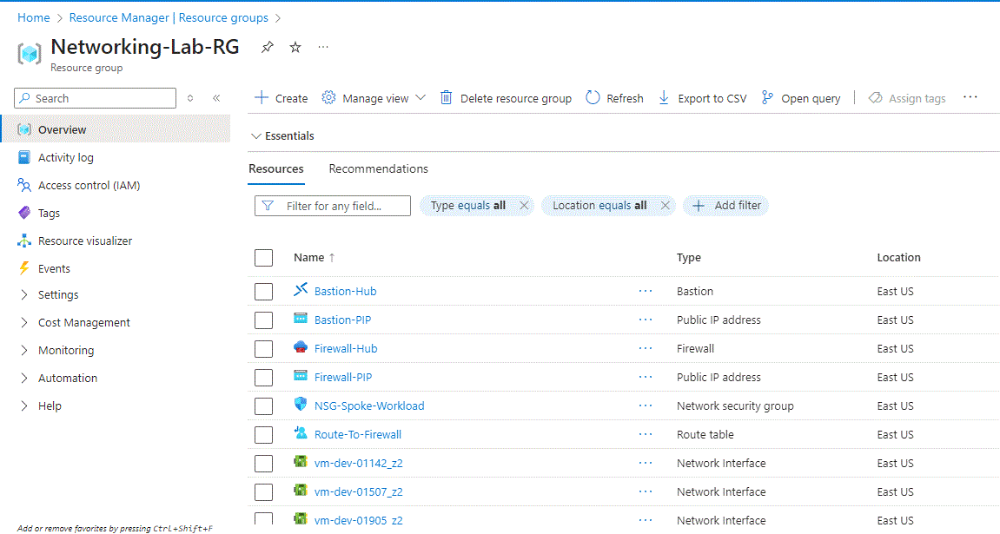
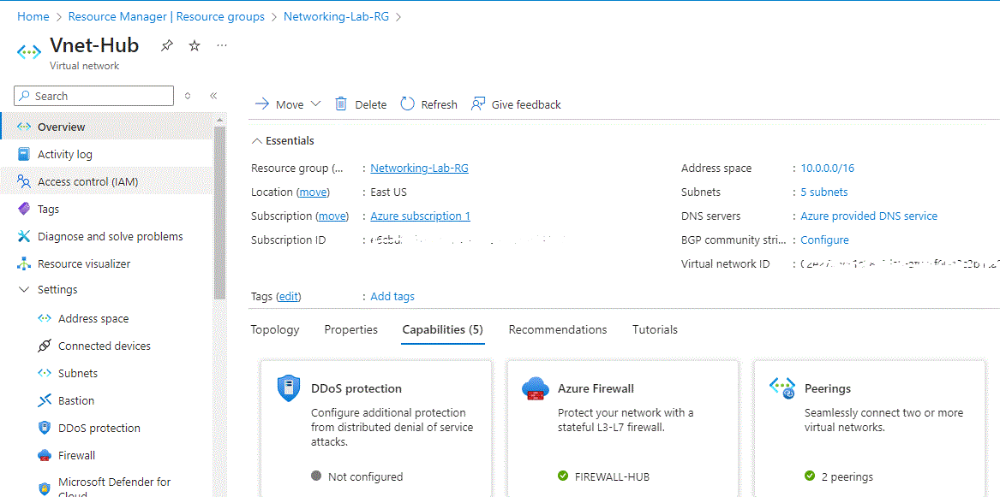

### Phase 2: Spoke VNets (Dev & Prod)
I deployed two separate VNets with non-overlapping address spaces to simulate environment isolation:
* **Spoke-Dev:** `10.1.0.0/16`
* **Spoke-Prod:** `10.2.0.0/16`

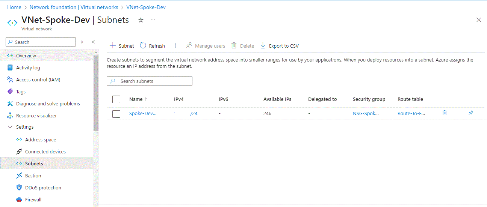

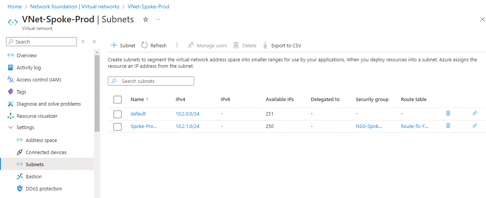

### Phase 3: VNet Peering
I connected the Spokes to the Hub. No direct peering exists between the spokes, forcing a Hub-and-Spoke traffic pattern.

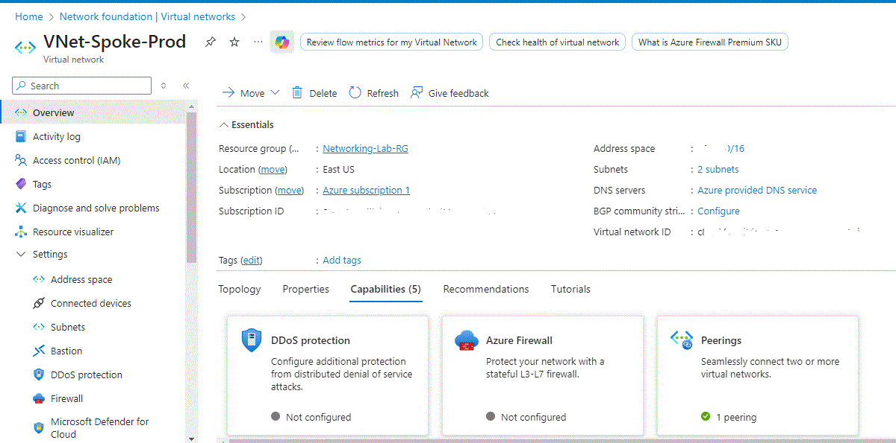

### Phase 4: Security Controls & Routing
This phase involved locking down the network using Azure Firewall, NSGs, and custom Route Tables (UDR). I configured a **0.0.0.0/0** route pointing to the Firewall private IP (`10.0.1.4`) to ensure all egress traffic is inspected.

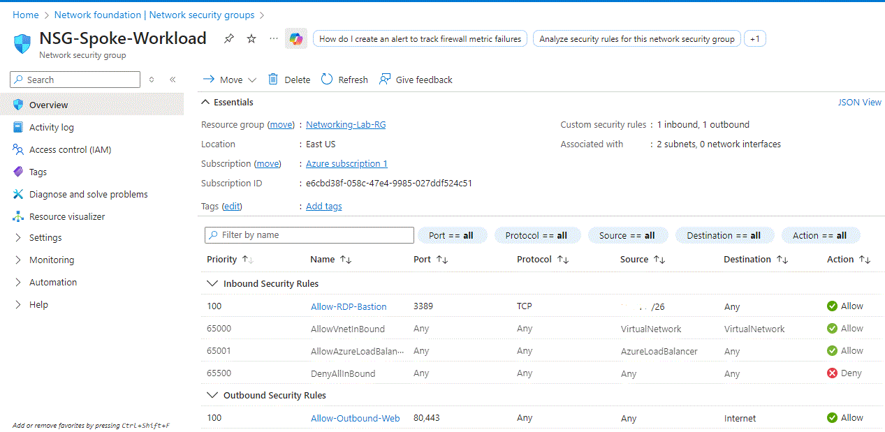

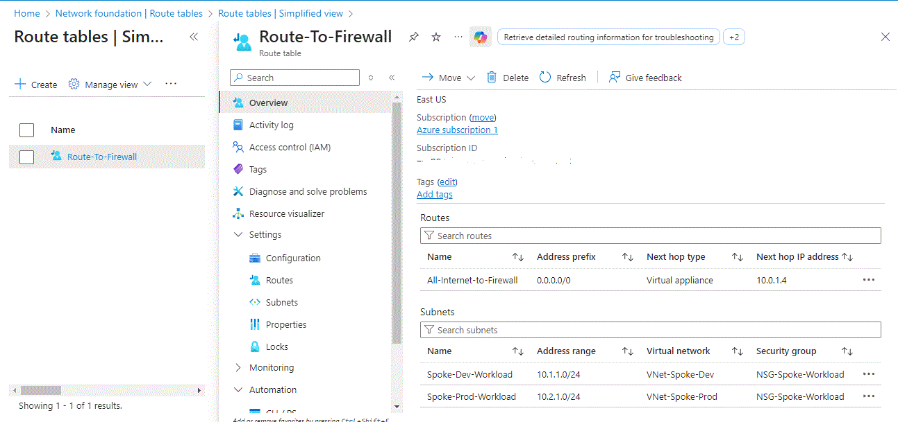

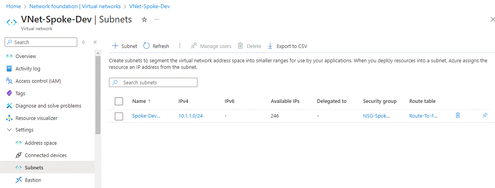
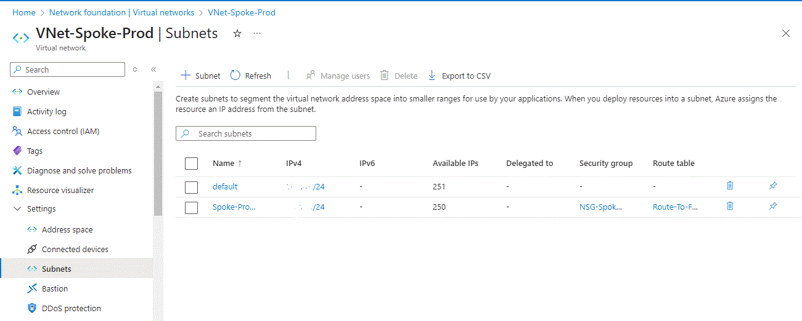

### Phase 5: Validation & Testing
I verified the architecture worked as intended through connectivity and security tests.

**Secure Access:**

**Egress Firewall Testing (Browser):**

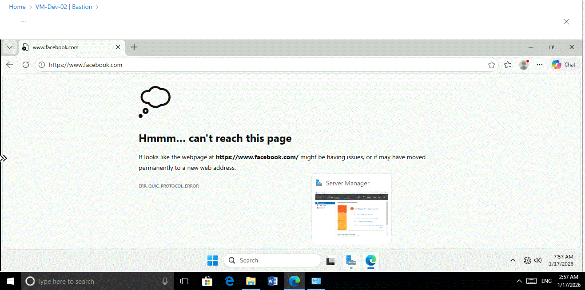

**Network Command Line Validation:**
Testing from source IP `10.10.0.4` (Dev Workload) confirmed that traffic to allowed domains was successful while unauthorized requests were dropped.

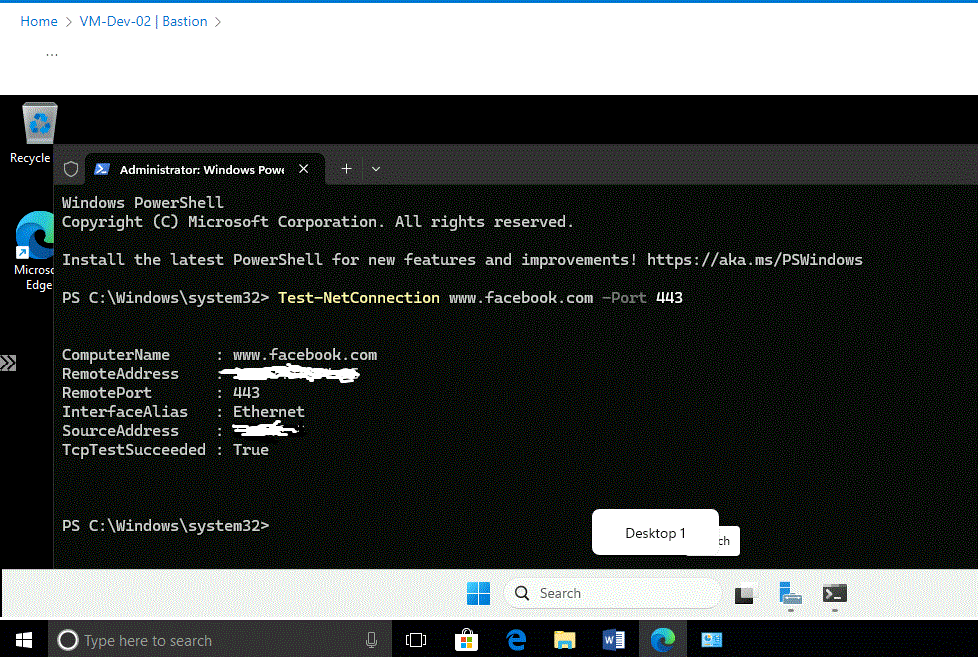
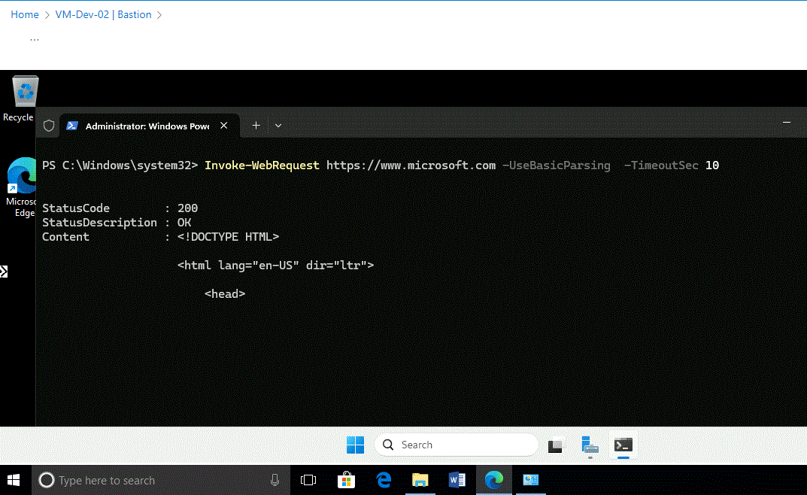
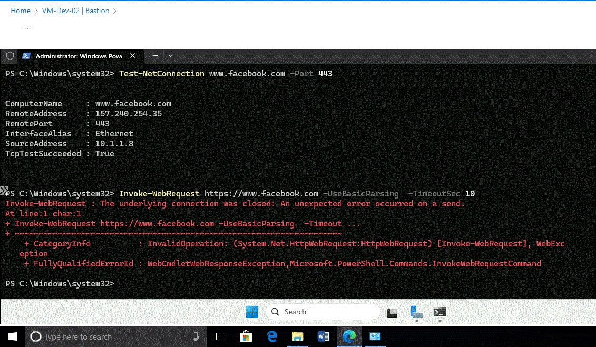
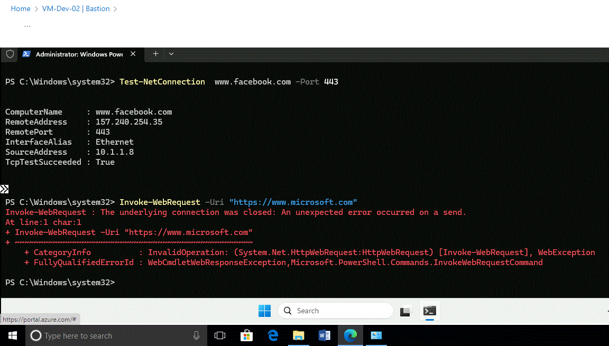

---

## Technical Challenges Faced

* **The "Invisible" Internet Path:** Initially, VMs tried to bypass the firewall using default routes. I solved this by implementing **User-Defined Routes (UDRs)** to override Azure's default routing logic.
* **Secure Management:** Eliminated the risk of "Brute Force" attacks on RDP by removing all Public IPs and deploying **Azure Bastion**, ensuring all management happens over a secure SSL tunnel.

---

**Note:** All resources were deployed within a single resource group (**Networking-Lab-RG**) and deleted after validation to ensure cost-efficiency.
