# Azure Secure Hub-and-Spoke Networking Project

**Project Title**  
Secure Enterprise Hub-and-Spoke Topology with Centralized Security

**Date**  
January 2026

**Aim of the Project**  
Demonstrate a secure, scalable Azure network design using Microsoft’s recommended **hub-and-spoke** pattern.  
The goal was to:
- Centralize security (Firewall inspects all traffic, Bastion provides safe access)
- Isolate workloads (Dev and Prod cannot talk directly)
- Control internet access (block unwanted sites like facebook.com)
- Provide secure remote access without public IPs

**Why Hub-and-Spoke?**  
A flat network is risky — one compromise can spread everywhere.  
Hub-and-spoke keeps security tools in one central hub while spokes stay isolated. All traffic flows through the hub → easier to monitor and control.

**Phases & What Was Accomplished**

**Phase 1 – Hub VNet**  
Created the central hub network (`VNet-Hub`) with dedicated subnets for Firewall, Bastion, and future VPN.  
→ Provides a secure, organized place for shared services that all spokes can use.

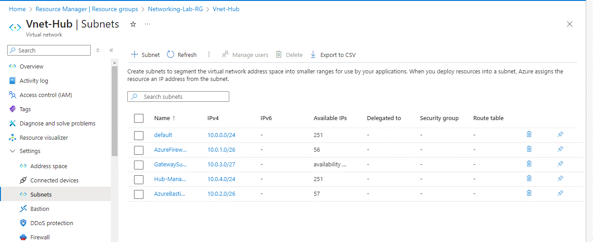  
*Hub VNet showing address space and special-purpose subnets (Firewall, Bastion, Gateway, Management)*

**Phase 2 – Spoke VNets**  
Created two separate spokes (`VNet-Spoke-Dev` and `VNet-Spoke-Prod`) with non-overlapping address spaces.  
→ Simulates isolated development and production environments, preventing overlap and reducing risk.

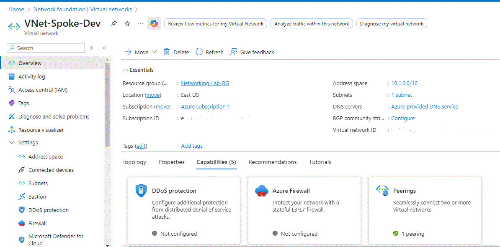  
*Development spoke VNet overview*

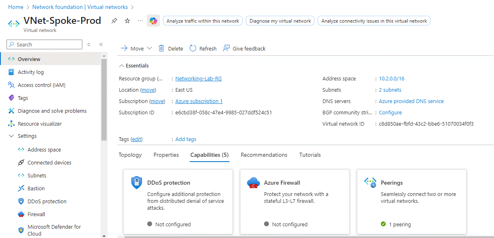  
*Production spoke VNet overview*

**Phase 3 – VNet Peering**  
Connected hub ↔ spokes (bidirectional peering, no direct spoke-to-spoke).  
→ Allows spokes to use hub security tools without exposing each other directly.

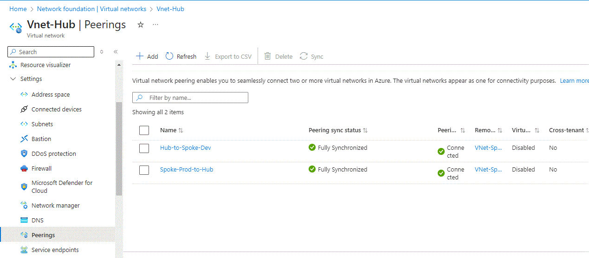  
*Hub VNet peerings showing Connected status to both spokes*

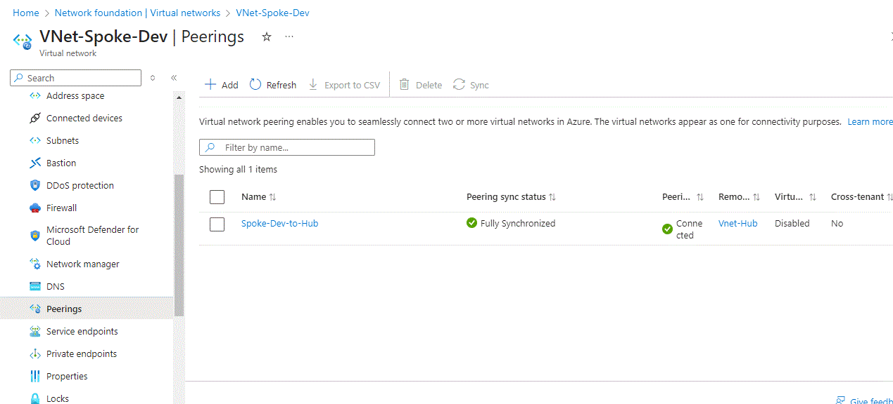  
*Spoke-Dev peering back to hub (Connected)*

**Phase 4 – Security Controls**  
- Applied NSGs to spoke subnets (allow only RDP from Bastion, outbound web; deny all else)  
- Deployed Azure Firewall in hub (allows microsoft.com, denies everything else by default)  
- Added UDR to force spoke internet traffic through Firewall  
- Deployed Azure Bastion for secure browser-based RDP (no public IPs on VMs)  
→ Centralizes inspection, enforces least-privilege access, and enables safe remote management.

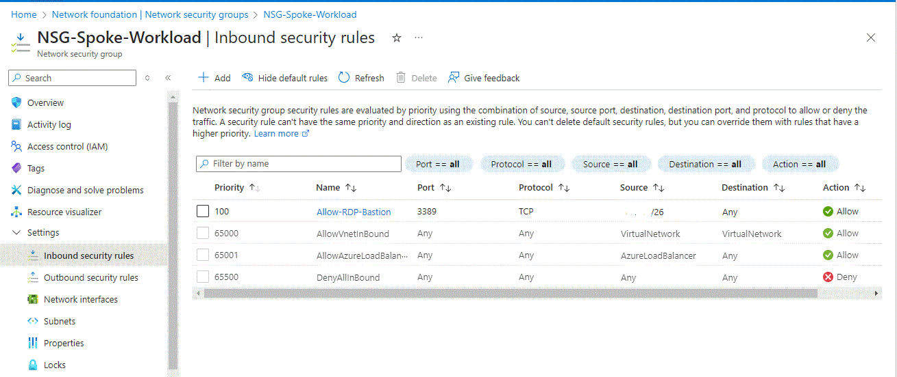  
*NSG inbound rule allowing RDP from Bastion subnet*

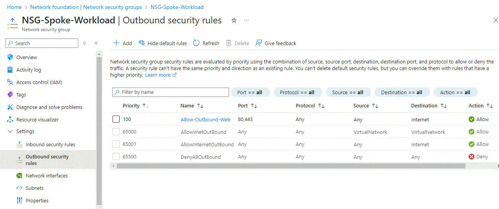  
*NSG outbound rule allowing web traffic*

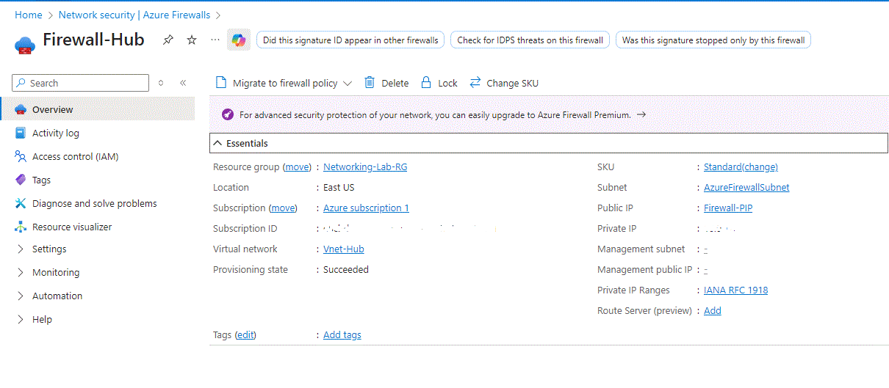  
*Azure Firewall deployed and running in hub*

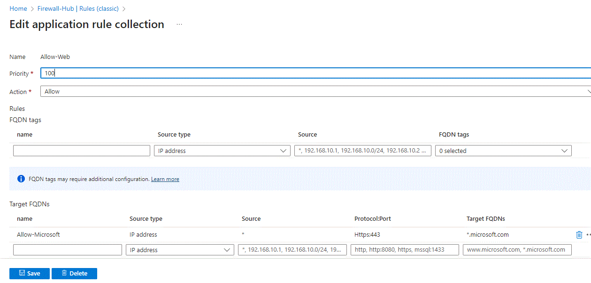  
*Application rule allowing *.microsoft.com*

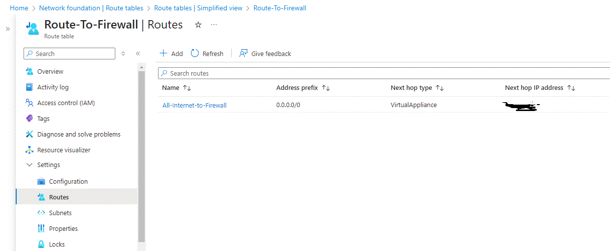  
*Route table forcing 0.0.0.0/0 traffic through Firewall private IP*

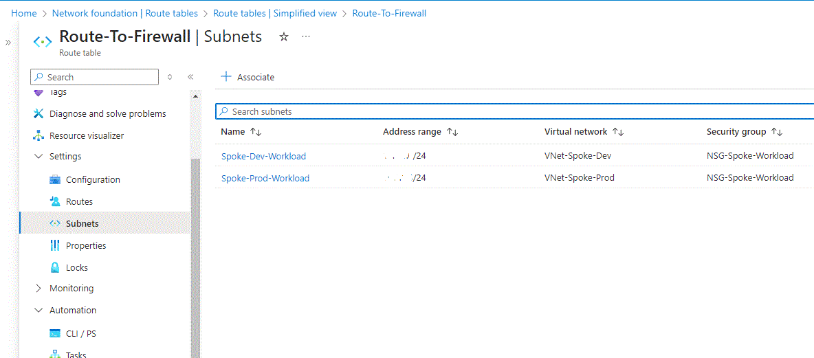  
*Route table associated to spoke workload subnets*

  
*Azure Bastion deployed and running*

**Phase 5 – Validation & Testing**  
- Isolation: Ping between Dev and Prod VMs fails (no direct path — security win)  
- Firewall egress: Internet traffic routed through Firewall  
  - Allowed sites (microsoft.com) load in browser  
  - Blocked sites (facebook.com) fail ("can't reach this page")  
  - Note: PowerShell `Test-NetConnection -Port 443` returned True for both sites because the TCP handshake is allowed. However, full HTTPS requests (browser / `Invoke-WebRequest`) to facebook.com failed due to Firewall application-layer deny (no matching rule).  
- Secure access: Bastion RDP to VMs works without public IPs  
→ Proves the design isolates workloads, inspects traffic, and blocks unwanted access.

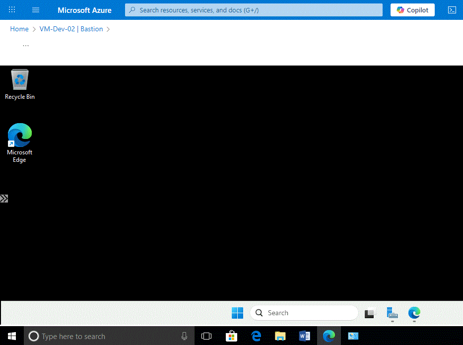  
*Secure Bastion RDP session to VM*

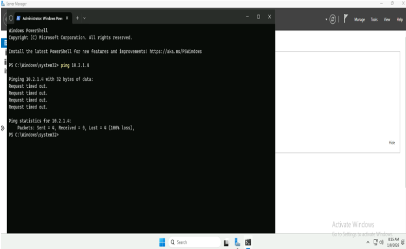  
*Ping from Dev VM to Prod VM private IP fails (timeout)*

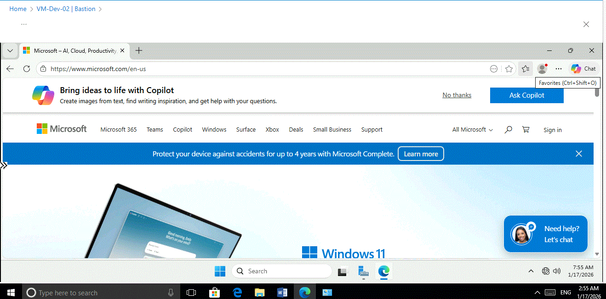  
*Browser loads microsoft.com (allowed by rule)*

  
*Browser fails to load facebook.com (blocked by Firewall default deny)*

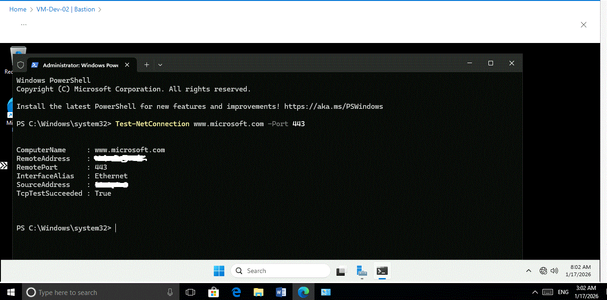  
*Test-NetConnection microsoft.com Port 443 → True (TCP handshake allowed)*

  
*Test-NetConnection facebook.com Port 443 → True (TCP handshake allowed, but application blocked)*

**Cleanup**  
All resources in single resource group `Networking-Lab-RG` — deleted after validation.

This lab reflects self-directed learning of Azure networking best practices and prepares me to contribute to secure cloud infrastructure projects.

Feedback or questions welcome!
